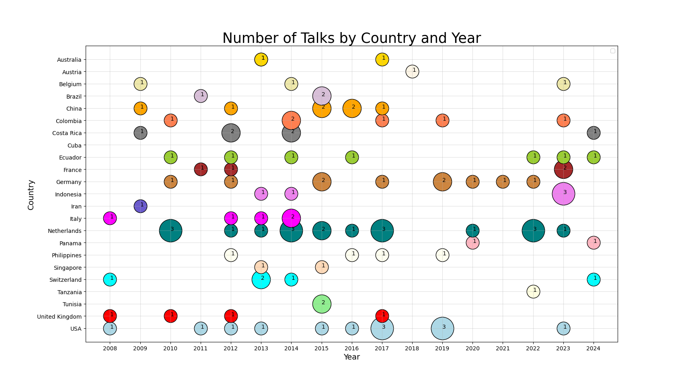

## Bubble Chart Application 📊
---
This is a Python-based implementation of a Bubble Chart visualization. It uses `matplotlib`, `pandas`, and `numpy` to generate a bubble chart based on the number of talks by country and year.

## Features

- **Dynamic Bubble Chart**: Visualizes the number of talks per country and year.


## Demo




In this demo, the chart shows example data with randomly assigned years, countries, and talk counts.

## 🚀 Prerequisites

Before running the script, make sure you have the following software and packages installed:

### 1. **Python** (>= 3.7)

To install Python, download the latest version from the [official Python website](https://www.python.org/downloads/). If you're unsure whether you already have Python installed, you can check by running the following command in your terminal:

```bash
python --version
```
2. Git 
You'll also need [Git](https://git-scm.com/downloads) installed to clone the repository. You can verify if Git is installed by running:
```bash
git --version
```

3. Required Python packages:
   - `matplotlib`
   - `numpy`
   - `pandas`

Install these packages using the following command:
```bash
pip install matplotlib numpy pandas
```
Alternatively, you can install all dependencies at once using the `requirements.txt` file (if it's included in the repository):
```bash 
pip install -r requirements.txt
```
The `requirements.txt` file contains the following lines:
```
matplotlib
numpy
pandas
```

## Running the Script

1. Open Terminal:
On Windows, open the terminal by searching for CMD or PowerShell in the Start menu.

2. Clone the repository:
```bash 
git clone https://github.com/Omid2831/ChartBubbleGraph.git
```
3. Navigate into the project directory:
```bash 
cd ChartBubbleGraph
```
4. Run the Python script to generate the bubble chart:
```bash 
python bubblechart.py
```

## Alternative Way to Run the Application:

🚀 download the file and open it:
```
bubblechart.exe
```
Enjoy! 🎉
If you need further assistance or have other questions, please ask! 😊


## 📂 File Structure 🛠️

<pre>
📂 ChartBubbleGraph 
   ├── bubblechart.py          # Main Python script for generating the bubble chart
   ├── 📂 img
   │   └── BubbleGraph_Chart.png  # Screenshot of the bubble chart
   ├── requirements.txt        # List of required libraries 
   ├── README.md               # Documentation file for the project
   ├── bubblechart.zip         # This is the run application IRL
   └── demo_video.mp4          # Demo video showing the chart generation process
   
</pre>

## Collaboration & Improvements🤝 

I just wanted to let you know that this project is open for further collaboration. 
If you have ideas on improving the visualization, adding new features, or any suggestions, feel free to fork the repository or submit a pull request.
Let’s make this project even better together! 🚀
